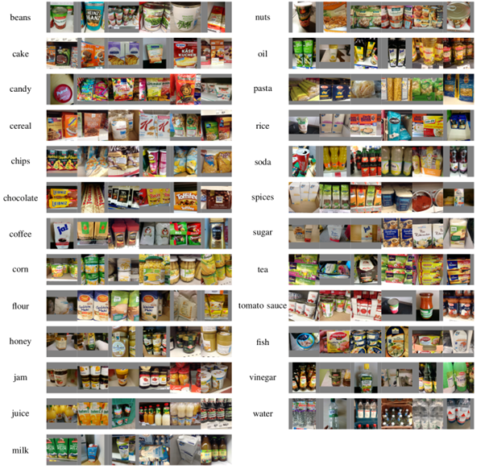

<a id="top"></a>

<!-- Banner -->
<p align="center">
  <a href="https://www.uit.edu.vn/" title="Trường Đại học Công nghệ Thông tin" style="border: none;">
    
  </a>
</p>

<h1 align="center"><b>NHẬN DẠNG<br>(PATTERN RECOGNITION)</b></h>

[](https://github.com/DoThiThuTrang/CS338.N21.KHCL)
[](https://github.com/DoThiThuTrang/CS338.N21.KHCL/graphs/contributors)
[](https://github.com/DoThiThuTrang/CS338.N21.KHCL)

## [BẢNG MỤC LỤC](#top)
* [Giới thiệu môn học](#giới-thiệu-môn-học)
* [Thông tin các thành viên](#thông-tin-về-các-thành-viên-nhóm)
* [Thông tin đồ án](#thông-tin-đồ-án)
* [Các bước cần thiết](#các-bước-cần-thiết)
* [Deployment](#deployment)

## [GIỚI THIỆU MÔN HỌC](#top)
* **Tên môn học:** Nhận dạng - Pattern Recognition
* **Mã môn học:** CS338
* **Mã lớp:** CS338.N21.KHCL
* **Năm học:** HK2 (2022 - 2023)
* **Giảng viên:** ThS. Đỗ Văn Tiến

## [THÔNG TIN VỀ CÁC THÀNH VIÊN NHÓM](#top)

| STT    | MSSV          | Họ và Tên                |Vai trò    | Github                                          | Email                   |
| :----: |:-------------:| :-----------------------:|:---------:|:-----------------------------------------------:|:-------------------------:
| 1      | 20520278      | Phạm Hoàng Phúc          | Thành viên | [pahopu](https://github.com/pahopu)            | 20520278@gm.uit.edu.vn   |
| 2      | 20520816      | Đỗ Thị Thu Trang         | Trưởng nhóm| [DoThiThuTrang](https://github.com/DoThiThuTrang)| 20520816@gm.uit.edu.vn   |
| 3      | 20521663      | Nguyễn Đặng Bảo Ngọc     | Thành viên | [ngocndb03](https://github.com/ngocndb03)      | 20521663@gm.uit.edu.vn   |

## [THÔNG TIN ĐỒ ÁN](#top)
* **Đề tài đồ án:** Nhận dạng sản phẩm tạp hóa trong siêu thị - Supermarket Product Detection
* **Ngôn ngữ lập trình:** Python

## [CÁC BƯỚC CẦN THIẾT](#top)
Chúng tôi đã thực hiện qua 4 giai đoạn để giải quyết bài toán trên. Các giai đoạn đó sẽ lần lượt về data, train, validation và predict.

### 1. Data
* **Bộ dữ liệu lựa chọn:** Freiburg Groceries Dataset (2014) 
* **Số lượng:** 4800 bức ảnh của các đối tượng là hàng hóa được bày bán trong siêu thị. Những bức ảnh này được chụp ở nhiều góc độ khác nhau của từng hàng hóa, do đó, sẽ có sự khác nhau cả về độ sáng, kích thước cũng như góc độ của hàng hóa đó.   
* **Số nhóm phân loại:** 25 nhóm sản phẩm phổ biến khác nhau.


Nguồn dataset: http://aisdatasets.informatik.uni-freiburg.de/freiburg_groceries_dataset/
### 2. Train

### 3. Validation

### 4. Predict

## [DEPLOYMENT](#top)

### 1. Giới thiệu
* **Công cụ hỗ trợ:** Streamlit
* **Link demo:** [link](https://drive.google.com/file/d/1A8Z_NneHT906PZraNkhBzUzwNszRX0fH/view)

### 2. Các bước cần thiết

#### a. Clone project
Clone project repository bằng câu lệnh dưới đây.

```bash
git clone https://github.com/DoThiThuTrang/CS338.N21.KHCL.git
```

#### b. Cài đặt thư viện
Bạn cần tiến hành cài đặt các thư viện cần thiết cho project với câu lệnh dưới đây.

```bash
cd Deployment
pip install -r requirements.txt
```

#### c. Chạy code
Sau khi cài đặt thư viện, dùng câu lệnh dưới đây để chạy code.
```bash
streamlit run app.py
```
